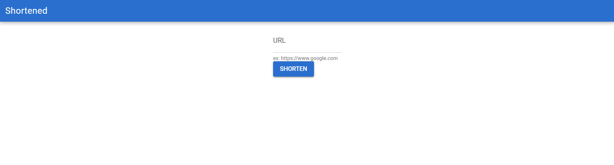
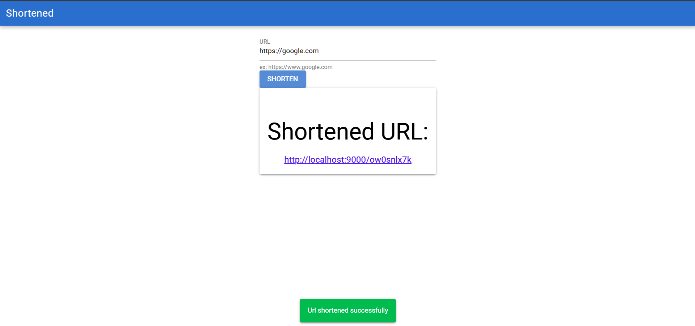
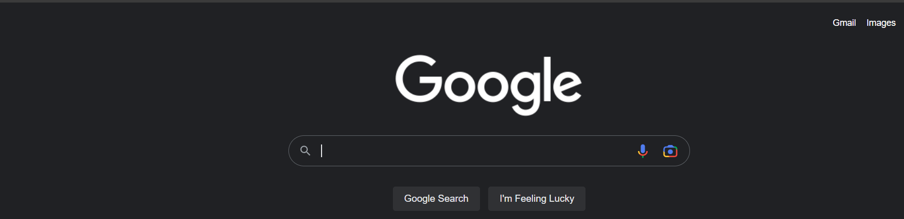

# Shortened

Shortened is a URL Shortener Service, created using Typescript, NodeJS, ExpressJS, MongoDB, VueJS, Quasar.

## Usage

- Ability to shorten any valid URL for easier sharing
- User Registration for using the service
- Limited to 5 requests per hour

## Bootstrapping

- Clone the repo and open the folder in your code editor
- Change the '.env.example' files in both backend and frontend folders to '.env' files and update the properties properly
- Create an instance of the terminal and copy-paste the following:

```sh
cd backend
npm i
npm start
```

- Create another instance of the terminal and copy-paste the following:

```sh
cd frontend
npm i
npm i -g @quasar/cli
quasar dev
```

## Views





## License

[MIT](LICENSE)
